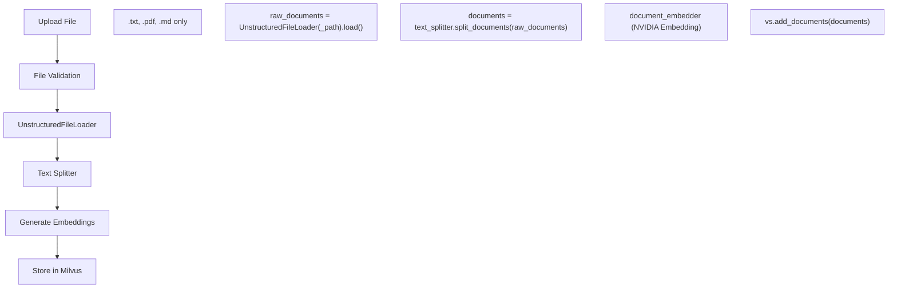
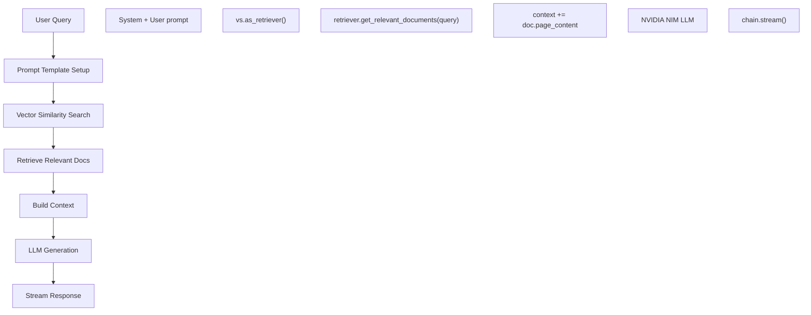

# RAG System Code Flow Documentation

## 🎯 **Tổng quan Code Architecture**

### **High-Level Code Structure**
```
basic_rag_system/
├── 🎯 langchain/chains.py           # Core RAG Logic
├── 🔌 chain_server/server.py        # FastAPI Endpoints
├── 🔧 chain_server/utils.py         # Helper Functions
├── 🌐 rag_playground/               # Frontend UI
└── 🐳 docker-compose.yaml           # Container Orchestration
```

### **Key Classes & Components**
- **NvidiaAPICatalog**: Main RAG processing class
- **FastAPI Server**: REST API endpoints
- **Vector Store**: Milvus integration
- **LLM Integration**: NVIDIA NIM containers

---

## 🔄 **1. Document Ingestion Flow**

### **API Endpoint**: `POST /documents`

```python
# File: chain_server/server.py:270
@app.post("/documents")
async def upload_document(file: UploadFile):
    # 1. Save uploaded file to /tmp-data/uploaded_files
    # 2. Call app.example().ingest_docs()
```

### **Core Ingestion Logic**: `chains.py:ingest_docs()`



### **Detailed Code Flow**:

```python
def ingest_docs(self, filepath: str, filename: str) -> None:
    # Step 1: File Validation
    if not filename.endswith((".txt", ".pdf", ".md")):
        raise ValueError(f"{filename} is not a valid file")
    
    # Step 2: Load Raw Document
    raw_documents = UnstructuredFileLoader(filepath).load()
    
    # Step 3: Get Text Splitter (if not cached)
    if not text_splitter:
        text_splitter = get_text_splitter()  # From utils.py
    
    # Step 4: Split Documents into Chunks
    documents = text_splitter.split_documents(raw_documents)
    
    # Step 5: Get Vector Store Instance
    vs = get_vectorstore(vectorstore, document_embedder)
    
    # Step 6: Generate Embeddings & Store
    vs.add_documents(documents)  # Calls NVIDIA Embedding API
```

### **Key Functions Called**:
- `get_text_splitter()` → Creates sentence-transformer based splitter
- `get_vectorstore()` → Returns Milvus instance
- `document_embedder` → NVIDIA NIM Embedding service

---

## 🔍 **2. Query Processing Flow** 

### **API Endpoint**: `POST /generate`

```python
# File: chain_server/server.py:313
@app.post("/generate")
async def chat_generate(request: ChainRequest):
    # Routes to either llm_chain() or rag_chain()
    if request.use_knowledge_base:
        return app.example().rag_chain()
    else:
        return app.example().llm_chain()
```

### **RAG Chain Flow**: `chains.py:rag_chain()`



### **Detailed RAG Code Flow**:

```python
def rag_chain(self, query: str, chat_history: List["Message"]) -> Generator[str, None, None]:
    # Step 1: Setup Prompt Template
    system_message = [("system", prompts.get("rag_template", ""))]
    user_input = [("user", "{input}")]
    prompt_template = ChatPromptTemplate.from_messages(system_message + user_input)
    
    # Step 2: Get LLM Instance
    llm = get_llm(**kwargs)  # NVIDIA NIM LLM
    
    # Step 3: Create Chain
    chain = prompt_template | llm | StrOutputParser()
    
    # Step 4: Vector Similarity Search
    vs = get_vectorstore(vectorstore, document_embedder)
    retriever = vs.as_retriever(
        search_type="similarity_score_threshold",
        search_kwargs={
            "score_threshold": settings.retriever.score_threshold,  # 0.25
            "k": settings.retriever.top_k,  # 5
        },
    )
    
    # Step 5: Retrieve Relevant Documents
    docs = retriever.get_relevant_documents(query)
    
    # Step 6: Build Context from Retrieved Docs
    context = ""
    for doc in docs:
        context += doc.page_content + "\n\n"
    
    # Step 7: Create Augmented Input
    augmented_user_input = "Context: " + context + "\n\nQuestion: " + query + "\n"
    
    # Step 8: Generate & Stream Response
    return chain.stream({"input": augmented_user_input})
```

---

## 🔧 **3. Configuration & Utilities Flow**

### **Configuration Loading**: `utils.py:get_config()`

```python
def get_config() -> Any:
    # Loads configuration from environment variables
    # Maps to configuration.py classes
    return config
```

### **LLM Initialization**: `utils.py:get_llm()`

```python
def get_llm(model_name: str = None, **kwargs) -> Any:
    # Step 1: Get model configuration
    llm_config = config.llm
    
    # Step 2: Choose LLM Engine
    if llm_config.model_engine == "nvidia_ai_endpoints":
        # NVIDIA NIM Container
        llm = ChatNVIDIA(
            model=llm_config.model_name,  # meta/llama3-8b-instruct
            base_url=llm_config.server_url,  # http://nemollm-inference:8000
            temperature=temperature,
            max_tokens=max_tokens,
        )
    
    return llm
```

### **Embedding Model**: `utils.py:get_embedding_model()`

```python
def get_embedding_model() -> Embeddings:
    # Step 1: Get embedding configuration
    embedding_config = config.embeddings
    
    # Step 2: Choose Embedding Engine
    if embedding_config.model_engine == "nvidia_ai_endpoints":
        # NVIDIA NIM Embedding Container
        embeddings = NVIDIAEmbeddings(
            model=embedding_config.model_name,  # nvidia/nv-embedqa-e5-v5
            base_url=embedding_config.server_url,  # http://nemollm-embedding:8000
        )
    
    return embeddings
```

### **Vector Store Setup**: `utils.py:get_vectorstore()`

```python
def get_vectorstore(vectorstore_instance, embedding_model):
    # Step 1: Check if vectorstore exists
    if vectorstore_instance is not None:
        return vectorstore_instance
    
    # Step 2: Create new Milvus instance
    return create_vectorstore_langchain(document_embedder=embedding_model)

def create_vectorstore_langchain(document_embedder) -> VectorStore:
    # Connect to Milvus
    vectorstore = Milvus(
        embedding_function=document_embedder,
        connection_args={
            "host": config.vector_store.url,  # milvus-standalone:19530
            "port": "19530",
        },
        collection_name=collection_name,  # nim_rag_collection
    )
    return vectorstore
```

---

## 🌐 **4. Frontend Integration Flow**

### **RAG Playground Architecture**

```python
# File: rag_playground/default/chat_client.py
class ChatClient:
    def __init__(self):
        self.chain_server_url = "http://chain-server:8081"
    
    def upload_document(self, file):
        # POST to /documents endpoint
        response = requests.post(f"{self.chain_server_url}/documents", files=files)
    
    def chat_with_rag(self, message):
        # POST to /generate endpoint
        data = {
            "messages": [{"role": "user", "content": message}],
            "use_knowledge_base": True
        }
        response = requests.post(f"{self.chain_server_url}/generate", json=data)
```

### **UI Flow**:
1. **Document Upload Tab**: Calls `/documents` API
2. **Chat Interface**: Calls `/generate` API với `use_knowledge_base=True`
3. **Settings Panel**: Configures model parameters

---

## 🐳 **5. Container Architecture Flow**

### **Service Dependencies**:

```yaml
# docker-compose.yaml
services:
  chain-server:
    depends_on:
      - milvus
      - nemollm-inference        # NIM LLM
      - nemollm-embedding        # NIM Embedding
  
  rag-playground:
    depends_on:
      - chain-server
```

### **Network Communication**:
```
Frontend (8090) ──► Chain Server (8081) ──► Milvus (19530)
                            │
                            ├──► NIM LLM (8000)
                            └──► NIM Embedding (9080)
```

---

## 🔍 **6. Data Models & Schemas**

### **Request/Response Models**:

```python
# chain_server/server.py
class ChainRequest(BaseModel):
    messages: List[Message]
    use_knowledge_base: bool = True
    model_name: Optional[str] = None
    temperature: Optional[float] = None
    max_tokens: Optional[int] = None

class Message(BaseModel):
    role: str  # "user" or "assistant" 
    content: str

class ChainResponse(BaseModel):
    id: str
    choices: List[Choice]
```

### **Configuration Models**:

```python
# chain_server/configuration.py
class VectorStoreConfig:
    name: str = "milvus"
    url: str = "http://milvus-standalone:19530"

class LLMConfig:
    model_name: str = "meta/llama3-8b-instruct"
    model_engine: str = "nvidia_ai_endpoints"
    server_url: str = "http://nemollm-inference:8000"

class EmbeddingsConfig:
    model_name: str = "nvidia/nv-embedqa-e5-v5"
    model_engine: str = "nvidia_ai_endpoints"
    server_url: str = "http://nemollm-embedding:8000"
```

---

## 🎯 **7. Customization Points**

### **🔧 Easy Customization Areas**:

#### **1. Prompt Templates** (`langchain/prompt.yaml`):
```yaml
rag_template: |
  You are a helpful AI assistant. Use the provided context to answer questions.
  Context: {context}
  Question: {question}
```

#### **2. Model Configuration** (`.env`):
```bash
# Change LLM model
APP_LLM_MODELNAME=meta/llama3-70b-instruct

# Change embedding model
APP_EMBEDDINGS_MODELNAME=nvidia/nv-embed-v1

# Adjust retrieval parameters
APP_RETRIEVER_TOPK=10
APP_RETRIEVER_SCORETHRESHOLD=0.5
```

#### **3. Text Splitting** (`utils.py:get_text_splitter()`):
```python
# Customize chunk size and overlap
text_splitter = SentenceTransformersTokenTextSplitter(
    chunk_size=512,          # Configurable
    chunk_overlap=50,        # Configurable
    model_name=model_name
)
```

#### **4. Custom RAG Logic** (`chains.py:rag_chain()`):
```python
# Add reranking, filtering, custom retrieval logic
docs = retriever.get_relevant_documents(query)

# Custom post-processing
filtered_docs = custom_filter_documents(docs)
reranked_docs = custom_rerank_documents(filtered_docs, query)
```

### **🚀 Advanced Customization Areas**:

#### **1. Custom Vector Store**:
```python
# Add support for other vector databases
def create_custom_vectorstore():
    # Implement ChromaDB, Pinecone, etc.
    pass
```

#### **2. Custom LLM Integration**:
```python
# Add support for other LLMs
def get_custom_llm():
    # Implement OpenAI, Anthropic, local models
    pass
```

#### **3. Multi-modal RAG**:
```python
# Add image, audio processing
def ingest_multimodal_docs():
    # Process images, PDFs with tables, etc.
    pass
```

---

## 📋 **8. Debugging & Monitoring**

### **Logging Points**:
```python
# Key logging locations
logger.info(f"Retrieved documents: {docs}")
logger.info(f"Prompt used: {prompt_template.format(input=augmented_user_input)}")
logger.info(f"LLM response: {response}")
```

### **Health Check Endpoints**:
```python
@app.get("/health")
async def health_check():
    # Check all service dependencies
    return {"status": "healthy"}
```

### **Error Handling**:
```python
# Common error scenarios
try:
    vs = get_vectorstore(vectorstore, document_embedder)
except Exception as e:
    logger.error(f"Vector store connection failed: {e}")
    return error_response
```

---

## 🎉 **Summary**

### **Key Entry Points cho Customization**:
1. **chains.py**: Core RAG logic
2. **utils.py**: Model & config management  
3. **prompt.yaml**: Prompt templates
4. **.env**: Model configuration
5. **server.py**: API endpoints

### **Common Customization Workflows**:
1. **New Model**: Update `.env` → restart containers
2. **New Prompt**: Edit `prompt.yaml` → restart chain-server
3. **New Retrieval Logic**: Modify `rag_chain()` in `chains.py`
4. **New Endpoint**: Add to `server.py` + corresponding method in `chains.py`

**Code flow này cho phép bạn hiểu và customize system một cách dễ dàng!** 🎯
